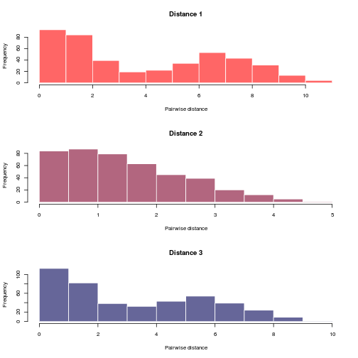
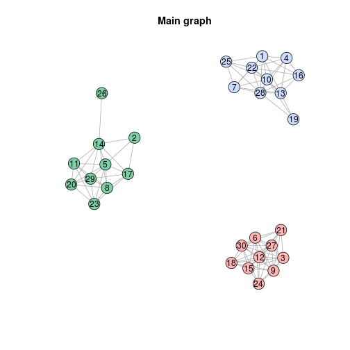
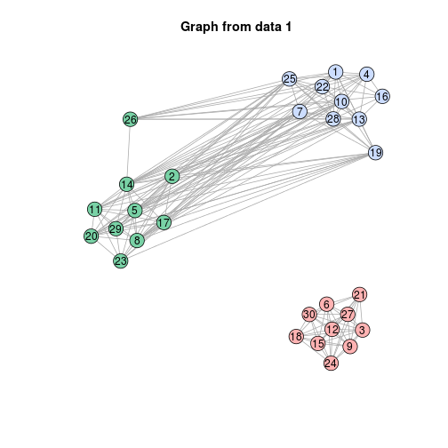
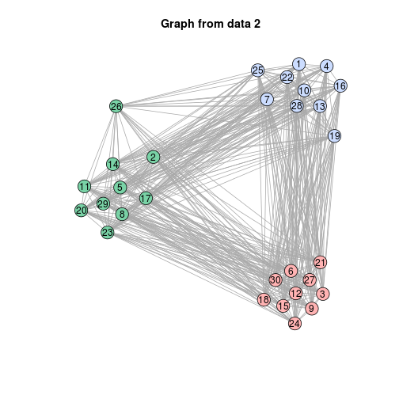
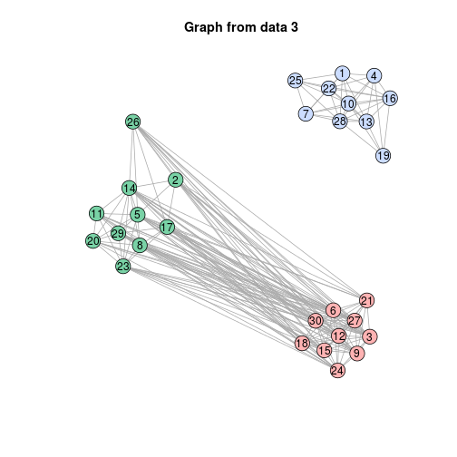

*vimes*: VIsualisation and Monitoring of EpidemicS 

=================================================

*vimes* provides tools for integrating various types of surveillance data for
 detecting disease outbreaks. This document provides an overview of the
 package's content.


Installing *vimes*
-------------
To install the development version from github:

```r
library(devtools)
install_github("reconhub/vimes")
```

The stable version can be installed from CRAN using:

```r
install.packages("vimes")
```

Then, to load the package, use:

```r
library("vimes")
```


A short demo
------------------
Here is a short demonstration of the package using a dummy dataset.

We first simulate the data using 3 mixtures of 3 normal distributions, and
compute Euclidean distances between the observations for each mixture.  In
practice, each mixture would be a different data type (e.g. location, time of
onset of symptoms, genetic sequences of the pathogen):


```r
set.seed(2)
dat1 <- rnorm(30, c(0,1,6))
dat2 <- rnorm(30, c(0,0,1))
dat3 <- rnorm(30, c(8,1,2))
x <- lapply(list(dat1, dat2, dat3), dist)
```

The function `vimes_data` processes the data and ensures matching of the
individuals across different data sources:


```r
x <- vimes_data(x)
plot(x)
```



We can now run `vimes` on the data:

```r
res <- vimes(x, cutoff = c(2,4,2))
names(res)
```

```
## [1] "graph"           "clusters"        "cutoff"          "separate_graphs"
```

```r
res$graph
```

```
## IGRAPH UN-- 30 104 -- 
## + attr: layout_1 (g/n), layout_2 (g/n), layout_3 (g/n), layout
## | (g/n), color_1 (v/c), color_2 (v/c), color_3 (v/c), size_1
## | (v/n), size_2 (v/n), size_3 (v/n), label.family_1 (v/c),
## | label.family_2 (v/c), label.family_3 (v/c), label.color_1 (v/c),
## | label.color_2 (v/c), label.color_3 (v/c), name (v/c), color
## | (v/c), size (v/n), label.family (v/c), label.color (v/c),
## | weight_1 (e/n), weight_2 (e/n), weight_3 (e/n), label.color_1
## | (e/c), label.color_2 (e/c), label.color_3 (e/c), label.color
## | (e/c)
## + edges (vertex names):
```

```r
res$clusters
```

```
## $membership
##  1  2  3  4  5  6  7  8  9 10 11 12 13 14 15 16 17 18 19 20 21 22 23 24 25 
##  1  2  3  1  2  3  1  2  3  1  2  3  1  2  3  1  2  3  1  2  3  1  2  3  1 
## 26 27 28 29 30 
##  2  3  1  2  3 
## 
## $size
## [1] 10 10 10
## 
## $K
## [1] 3
## 
## $color
##         1         2         3 
## "#ccddff" "#79d2a6" "#ffb3b3"
```

The main graph is:

```r
plot(res$graph, main="Main graph")
```



```r
for(i in 1:3) {
plot(res$separate_graphs[[i]]$graph, main = paste("Graph from data", i))
}
```


